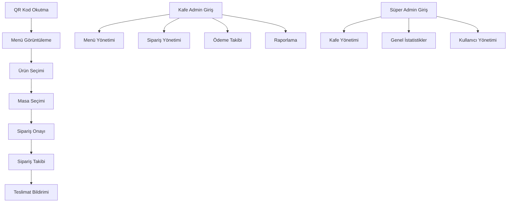

## 1. Ürün Genel Bakış
QR kod tabanlı menü sistemi, kafelerin dijital menülerini QR kod aracılığıyla müşterilerine sunmasını sağlayan, sipariş yönetimi ve ödeme takibi özelliklerine sahip kapsamlı bir çözümdür. Kafe sahiplerine admin paneli üzerinden menü yönetimi ve sipariş takibi imkanı sunar, müşterilere ise masa numarası seçerek kolay sipariş verme deneyimi sağlar.

Sistem, kafelerin dijital dönüşümünü destekleyerek operasyonel verimliliği artırmayı ve müşteri memnuniyetini yükseltmeyi hedefler. Çoklu panel yapısı ile süper admin, kafe admini ve son kullanıcı rollerine göre özelleştirilmiş arayüzler sunar.

## 2. Temel Özellikler

### 2.1 Kullanıcı Rolleri
| Rol | Kayıt Yöntemi | Temel İzinler |
|------|---------------------|------------------|
| Süper Admin | Manuel oluşturma | Tüm kafeleri yönetme, istatistik görüntüleme, yeni kafe admini ekleme |
| Kafe Admini | Süper admin tarafından oluşturulma | Menü yönetimi, sipariş takibi, raporlama, ödeme onayı |
| Müşteri | QR kod ile anonim erişim | Menü görüntüleme, sipariş verme, sipariş geçmişi görüntüleme |

### 2.2 Özellik Modülü
QR kod menü sistemi aşağıdaki temel sayfalardan oluşur:
1. **QR Menü Sayfası**: Ürün listesi, kategoriler, fiyatlar, sipariş butonları
2. **Sipariş Sayfası**: Masa seçimi, ürün adedi, sipariş özeti, onay
3. **Sipariş Takip Sayfası**: Sipariş durumu, geçmiş siparişler, bildirimler
4. **Kafe Admin Paneli**: Menü yönetimi, sipariş yönetimi, raporlama, ödeme takibi
5. **Süper Admin Paneli**: Kafe listesi, genel istatistikler, kullanıcı yönetimi

### 2.3 Sayfa Detayları
| Sayfa Adı | Modül Adı | Özellik Açıklaması |
|-----------|-------------|---------------------|
| QR Menü Sayfası | Ürün Listesi | Kategorilere göre filtreleme, ürün resimleri, fiyatlar, açıklamalar |
| QR Menü Sayfası | Sipariş Butonları | Her ürün için adet seçici ve sepete ekleme butonu |
| QR Menü Sayfası | Sepet Özeti | Seçilen ürünlerin listesi, toplam tutar, siparişe geçiş |
| Sipariş Sayfası | Masa Seçimi | Masa numarası seçici, özel notlar alanı |
| Sipariş Sayfası | Sipariş Onayı | Ürünlerin son kontrolü, toplam tutar, onay butonu |
| Sipariş Takip Sayfası | Sipariş Durumu | Gerçek zamanlı durum güncellemeleri (Beklemede, Hazırlanıyor, Teslim Edildi) |
| Sipariş Takip Sayfası | Bildirim Sistemi | Sipariş teslimi ve önemli durum değişiklikleri için bildirimler |
| Kafe Admin Paneli | Menü Yönetimi | Ürün ekleme/düzenleme/silme, kategori yönetimi, fiyat güncelleme |
| Kafe Admin Paneli | Sipariş Yönetimi | Gelen siparişleri görüntüleme, durum güncelleme, masa bazlı filtreleme |
| Kafe Admin Paneli | Ödeme Takibi | Masa bazlı ödeme durumu, günlük/aylık ciro raporları, fiş kesme |
| Süper Admin Paneli | Kafe Yönetimi | Yeni kafe ekleme, kafe admini atama, kafe silme |
| Süper Admin Paneli | Genel Raporlama | Tüm kafelerin istatistikleri, toplam ciro, aktif kullanıcı sayısı |

## 3. Temel Süreçler

### Müşteri Akışı:
1. Müşteri QR kodu okutur
2. Kafe menüsü otomatik açılır
3. Ürünleri sepete ekler
4. Masa numarasını seçer
5. Siparişi onaylar
6. Sipariş durumunu takip eder
7. Teslimat bildirimini alır

### Kafe Admin Akışı:
1. Admin paneline giriş yapar
2. Menüsünü günceller (isteğe bağlı)
3. Gelen siparişleri görüntüler
4. Sipariş durumunu günceller
5. Ödemeleri takip eder
6. Günlük/aylık raporları inceler

### Süper Admin Akışı:
1. Süper admin paneline giriş yapar
2. Yeni kafeler ekler
3. Kafe adminlerini yönetir
4. Genel istatistikleri görüntüler
5. Sistem performansını izler

## 4. Kullanıcı Arayüzü Tasarımı

### 4.1 Tasarım Stili
- **Birincil Renk**: Modern yeşil (#10B981) - tazelik ve güven hissi
- **İkincil Renk**: Açık gri (#F3F4F6) - temiz ve sade arka plan
- **Buton Stili**: Yuvarlak köşeler, gölge efekti, hover animasyonları
- **Yazı Tipi**: Inter font ailesi, modern ve okunabilir
- **Düzen Stili**: Kart tabanlı düzen, grid sistem, mobil öncelikli responsive tasarım
- **İkon Stili**: Line ikonlar, minimalist tasarım, tutarlı kalınlık

### 4.2 Sayfa Tasarımı Genel Bakış
| Sayfa Adı | Modül Adı | UI Elementleri |
|-----------|-------------|-------------|
| QR Menü Sayfası | Ürün Listesi | Kart düzeni, ürün resimleri, fiyat etiketleri, sepet ikonu, sticky header |
| QR Menü Sayfası | Kategori Filtresi | Horizontal scroll, aktif kategori vurgusu, ikon destekli |
| Sipariş Sayfası | Masa Seçimi | Dropdown menü, numara grid seçeneği, devam butonu |
| Sipariş Sayfası | Sepet Özeti | Ürün listesi, adet değiştirici, toplam tutar, onay butonu |
| Sipariş Takip Sayfası | Durum Göstergesi | Progress bar, renkli durum etiketleri, zaman damgası |
| Kafe Admin Paneli | Sipariş Listesi | Tablo görünümü, durum badge'leri, filtre butonları, arama çubuğu |
| Kafe Admin Paneli | Menü Yönetimi | Form alanları, resim yükleme, kategori seçici, fiyat girişi |
| Süper Admin Paneli | Dashboard | İstatistik kartları, grafikler, tablo listeleri, filtreleme araçları |

### 4.3 Responsive Tasarım
- **Mobil Öncelikli**: 320px'den başlayarak tasarlandı
- **Tablet Uyumu**: 768px ve üzeri ekranlar için optimize edilmiş düzen
- **Masaüstü Desteği**: 1024px ve üzeri geniş ekranlar için geliştirilmiş grid sistemi
- **Dokunmatik Optimizasyonu**: Büyük butonlar, swipe gesture'leri, kolay dokunma hedefleri

### 4.4 QR Kod ve Erişim
- QR kodlar masa başına özel oluşturulacak
- Kodlar masa numarasını içerecek şekilde dinamik üretilecek
- Kafe admini panelinden QR kod yazdırma ve indirme özelliği
- QR kod tasarımında kafe logosu ve masa numarası yer alacak