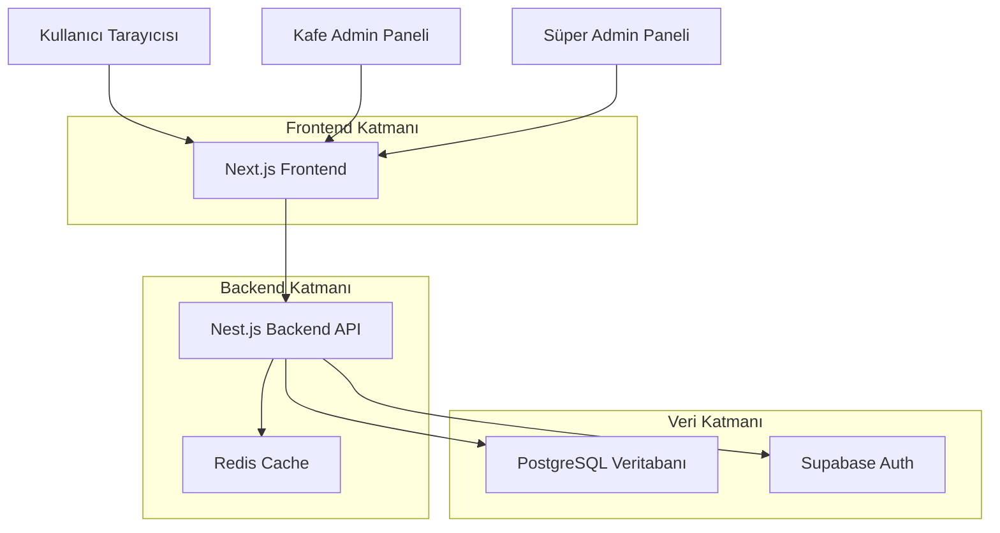
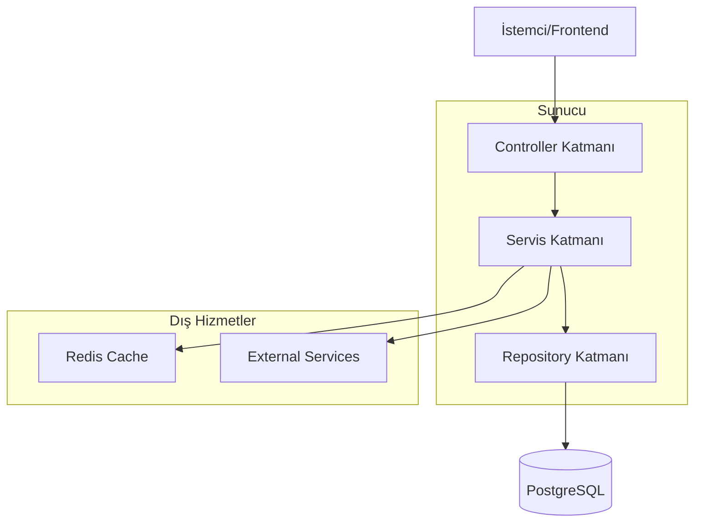
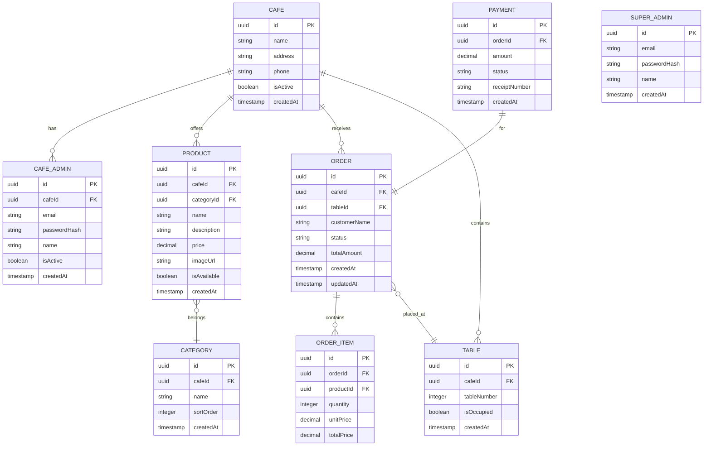

## 1. Mimar Tasarımı



## 2. Teknoloji Açıklaması
- **Frontend**: Next.js@14 + React@18 + TypeScript + Tailwind CSS
- **Backend**: Nest.js@10 + TypeScript + Express
- **Veritabanı**: PostgreSQL@15
- **Cache**: Redis@7
- **Authentication**: Supabase Auth
- **Real-time**: Socket.io
- **QR Kod**: qrcode.js
- **Başlatma Aracı**: create-next-app, @nestjs/cli

## 3. Route Tanımlamaları
| Route | Amaç |
|-------|---------|
| / | QR kod ile gelen kullanıcılar için menü görüntüleme |
| /menu/[cafeId] | Kafe menüsünü görüntüleme |
| /order/[cafeId] | Sipariş oluşturma ve masa seçimi |
| /track/[orderId] | Sipariş takibi ve durum görüntüleme |
| /admin/login | Kafe admin girişi |
| /admin/dashboard | Kafe admin paneli ana sayfası |
| /admin/menu | Menü yönetimi |
| /admin/orders | Sipariş yönetimi |
| /admin/payments | Ödeme takibi ve raporlama |
| /super-admin/login | Süper admin girişi |
| /super-admin/dashboard | Süper admin paneli |
| /super-admin/cafes | Kafe yönetimi |
| /super-admin/reports | Genel raporlama |

## 4. API Tanımlamaları

### 4.1 Kimlik Doğrulama API'leri

**Kafe Admin Girişi**
```
POST /api/auth/cafe-admin/login
```

İstek:
| Parametre Adı | Parametre Türü | Zorunlu | Açıklama |
|-----------|-------------|-------------|-------------|
| email | string | evet | Kafe admin e-postası |
| password | string | evet | Şifre |

Yanıt:
| Parametre Adı | Parametre Türü | Açıklama |
|-----------|-------------|-------------|
| token | string | JWT token |
| cafeId | string | Kafe kimliği |
| admin | object | Admin bilgileri |

**Süper Admin Girişi**
```
POST /api/auth/super-admin/login
```

### 4.2 Menü API'leri

**Kafe Menüsünü Getir**
```
GET /api/menu/:cafeId
```

Yanıt:
```json
{
  "cafeId": "uuid",
  "name": "Kafe Adı",
  "categories": [
    {
      "id": "uuid",
      "name": "Kategori Adı",
      "products": [
        {
          "id": "uuid",
          "name": "Ürün Adı",
          "description": "Açıklama",
          "price": 25.50,
          "image": "url",
          "available": true
        }
      ]
    }
  ]
}
```

### 4.3 Sipariş API'leri

**Sipariş Oluştur**
```
POST /api/orders
```

İstek:
| Parametre Adı | Parametre Türü | Zorunlu | Açıklama |
|-----------|-------------|-------------|-------------|
| cafeId | string | evet | Kafe kimliği |
| tableNumber | number | evet | Masa numarası |
| items | array | evet | Sipariş ürünleri |
| customerName | string | hayır | Müşteri adı |

**Sipariş Durumu Güncelle**
```
PUT /api/orders/:orderId/status
```

### 4.4 Ödeme API'leri

**Masa Ödemesini Getir**
```
GET /api/payments/table/:tableNumber/:cafeId
```

**Ödeme Onayı**
```
POST /api/payments/confirm
```

### 4.5 Raporlama API'leri

**Günlük Ciro Raporu**
```
GET /api/reports/daily/:cafeId?date=YYYY-MM-DD
```

**Aylık Ciro Raporu**
```
GET /api/reports/monthly/:cafeId?month=YYYY-MM
```

## 5. Sunucu Mimarisi Diyagramı



## 6. Veri Modeli

### 6.1 Veri Modeli Tanımı



### 6.2 Veri Tanım Dili (DDL)

**Kafeler Tablosu (cafes)**
```sql
CREATE TABLE cafes (
    id UUID PRIMARY KEY DEFAULT gen_random_uuid(),
    name VARCHAR(255) NOT NULL,
    address TEXT,
    phone VARCHAR(20),
    is_active BOOLEAN DEFAULT true,
    created_at TIMESTAMP WITH TIME ZONE DEFAULT NOW(),
    updated_at TIMESTAMP WITH TIME ZONE DEFAULT NOW()
);

CREATE INDEX idx_cafes_active ON cafes(is_active);
```

**Kafe Adminleri Tablosu (cafe_admins)**
```sql
CREATE TABLE cafe_admins (
    id UUID PRIMARY KEY DEFAULT gen_random_uuid(),
    cafe_id UUID REFERENCES cafes(id) ON DELETE CASCADE,
    email VARCHAR(255) UNIQUE NOT NULL,
    password_hash VARCHAR(255) NOT NULL,
    name VARCHAR(100) NOT NULL,
    is_active BOOLEAN DEFAULT true,
    created_at TIMESTAMP WITH TIME ZONE DEFAULT NOW(),
    updated_at TIMESTAMP WITH TIME ZONE DEFAULT NOW()
);

CREATE INDEX idx_cafe_admins_cafe ON cafe_admins(cafe_id);
CREATE INDEX idx_cafe_admins_email ON cafe_admins(email);
```

**Süper Adminler Tablosu (super_admins)**
```sql
CREATE TABLE super_admins (
    id UUID PRIMARY KEY DEFAULT gen_random_uuid(),
    email VARCHAR(255) UNIQUE NOT NULL,
    password_hash VARCHAR(255) NOT NULL,
    name VARCHAR(100) NOT NULL,
    created_at TIMESTAMP WITH TIME ZONE DEFAULT NOW(),
    updated_at TIMESTAMP WITH TIME ZONE DEFAULT NOW()
);
```

**Kategoriler Tablosu (categories)**
```sql
CREATE TABLE categories (
    id UUID PRIMARY KEY DEFAULT gen_random_uuid(),
    cafe_id UUID REFERENCES cafes(id) ON DELETE CASCADE,
    name VARCHAR(100) NOT NULL,
    sort_order INTEGER DEFAULT 0,
    created_at TIMESTAMP WITH TIME ZONE DEFAULT NOW(),
    updated_at TIMESTAMP WITH TIME ZONE DEFAULT NOW()
);

CREATE INDEX idx_categories_cafe ON categories(cafe_id);
CREATE INDEX idx_categories_sort ON categories(cafe_id, sort_order);
```

**Ürünler Tablosu (products)**
```sql
CREATE TABLE products (
    id UUID PRIMARY KEY DEFAULT gen_random_uuid(),
    cafe_id UUID REFERENCES cafes(id) ON DELETE CASCADE,
    category_id UUID REFERENCES categories(id) ON DELETE CASCADE,
    name VARCHAR(255) NOT NULL,
    description TEXT,
    price DECIMAL(10,2) NOT NULL,
    image_url VARCHAR(500),
    is_available BOOLEAN DEFAULT true,
    created_at TIMESTAMP WITH TIME ZONE DEFAULT NOW(),
    updated_at TIMESTAMP WITH TIME ZONE DEFAULT NOW()
);

CREATE INDEX idx_products_cafe ON products(cafe_id);
CREATE INDEX idx_products_category ON products(category_id);
CREATE INDEX idx_products_available ON products(cafe_id, is_available);
```

**Masalar Tablosu (tables)**
```sql
CREATE TABLE tables (
    id UUID PRIMARY KEY DEFAULT gen_random_uuid(),
    cafe_id UUID REFERENCES cafes(id) ON DELETE CASCADE,
    table_number INTEGER NOT NULL,
    is_occupied BOOLEAN DEFAULT false,
    created_at TIMESTAMP WITH TIME ZONE DEFAULT NOW(),
    updated_at TIMESTAMP WITH TIME ZONE DEFAULT NOW(),
    UNIQUE(cafe_id, table_number)
);

CREATE INDEX idx_tables_cafe ON tables(cafe_id);
```

**Siparişler Tablosu (orders)**
```sql
CREATE TABLE orders (
    id UUID PRIMARY KEY DEFAULT gen_random_uuid(),
    cafe_id UUID REFERENCES cafes(id) ON DELETE CASCADE,
    table_id UUID REFERENCES tables(id) ON DELETE CASCADE,
    customer_name VARCHAR(100),
    status VARCHAR(20) DEFAULT 'pending' CHECK (status IN ('pending', 'preparing', 'delivered')),
    total_amount DECIMAL(10,2) DEFAULT 0,
    created_at TIMESTAMP WITH TIME ZONE DEFAULT NOW(),
    updated_at TIMESTAMP WITH TIME ZONE DEFAULT NOW()
);

CREATE INDEX idx_orders_cafe ON orders(cafe_id);
CREATE INDEX idx_orders_table ON orders(table_id);
CREATE INDEX idx_orders_status ON orders(cafe_id, status);
CREATE INDEX idx_orders_created ON orders(cafe_id, created_at);
```

**Sipariş Kalemleri Tablosu (order_items)**
```sql
CREATE TABLE order_items (
    id UUID PRIMARY KEY DEFAULT gen_random_uuid(),
    order_id UUID REFERENCES orders(id) ON DELETE CASCADE,
    product_id UUID REFERENCES products(id) ON DELETE CASCADE,
    quantity INTEGER NOT NULL CHECK (quantity > 0),
    unit_price DECIMAL(10,2) NOT NULL,
    total_price DECIMAL(10,2) NOT NULL,
    created_at TIMESTAMP WITH TIME ZONE DEFAULT NOW()
);

CREATE INDEX idx_order_items_order ON order_items(order_id);
CREATE INDEX idx_order_items_product ON order_items(product_id);
```

**Ödemeler Tablosu (payments)**
```sql
CREATE TABLE payments (
    id UUID PRIMARY KEY DEFAULT gen_random_uuid(),
    order_id UUID REFERENCES orders(id) ON DELETE CASCADE,
    amount DECIMAL(10,2) NOT NULL,
    status VARCHAR(20) DEFAULT 'pending' CHECK (status IN ('pending', 'completed', 'failed')),
    receipt_number VARCHAR(50),
    created_at TIMESTAMP WITH TIME ZONE DEFAULT NOW(),
    updated_at TIMESTAMP WITH TIME ZONE DEFAULT NOW()
);

CREATE INDEX idx_payments_order ON payments(order_id);
CREATE INDEX idx_payments_status ON payments(status);
CREATE INDEX idx_payments_created ON payments(created_at);
```

## 7. Güvenlik ve Performans

### 7.1 Güvenlik Önlemleri
- JWT tabanlı kimlik doğrulama
- Şifreler bcrypt ile hash'lenir
- Rate limiting uygulanır
- SQL injection koruması
- CORS politikaları
- HTTPS zorunluluğu

### 7.2 Performans Optimizasyonları
- Redis cache sistemi
- Database indeksleme
- Lazy loading uygulamaları
- Image optimization
- CDN kullanımı